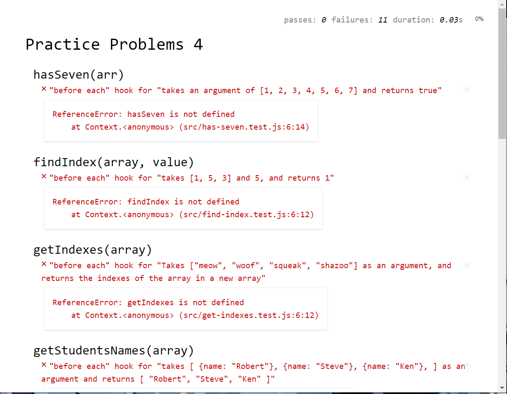
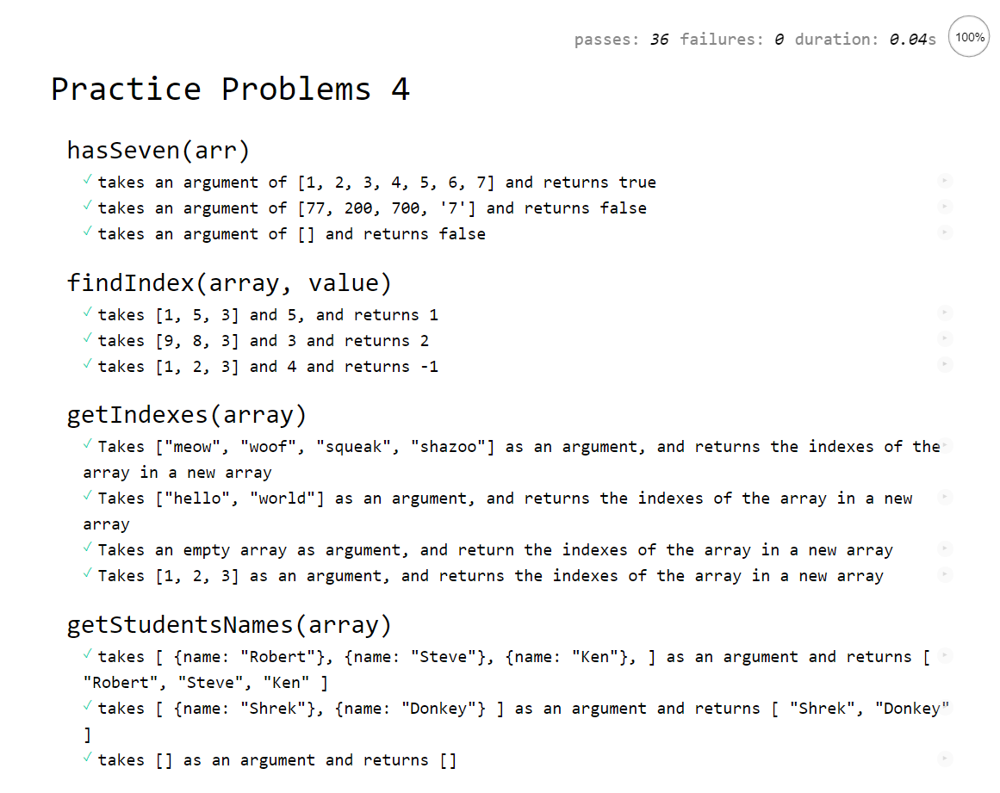

# practice-problems-4

JavaScript iteration practice with unit tests.

### Before You Begin

Be sure to check out a new branch (from `master`) for this exercise. Detailed instructions can be found [**here**](../../guides/before-each-exercise.md). Then navigate to the `exercises/practice-problems-4` directory in your terminal.

### Exercise

For this exercise you will be implementing several functions involving loops. You are given a description of each function, a suite of unit tests for each function, and an empty JavaScript file in which to write your implementation.

Your goal is to define each function according to its description, such that all of its tests pass.

Begin by skimming through `index.html` in your code editor, then opening it in your web browser. You should see **`ReferenceError: ... is not defined`** a few times on the page.

<p align="middle">
  
</p>

Open `src/find-seven.js` and `src/find-seven.test.js` in your code editor and skim the code in `find-seven.test.js`. As you add to or modify `find-seven.js`, reload `index.html` in your browser to receive feedback. Work through defining each function specified below until all unit tests pass.

<p align="middle">
  
</p>

1. ### `hasSeven(array)`

    The purpose of this function is to check if an `array` has the number seven or not.

    #### Parameters

      - `array` - Any JavaScript `Array`

    #### Return Value

    `true` or `false` for whether or not `array` contains the JavaScript number 7.

    #### Examples

      ```js
      var argument1 = [1, 2, 3, 4, 5, 6, 7];
      hasSeven(argument1); // -> true

      var argument2 = [77, 200, 700, '7'];
      hasSeven(argument2); // -> false

      var argument3 = [];
      hasSeven(argument3); // -> false
      ```

1. ### `findIndex(array, value)`🚨

      🚨 **Do not use `Array.prototype.indexOf` in your implementation.**

    The purpose of this function is to find the index of the second argument, compared to the first array argument

    #### Parameters

      - `array` - Any JavaScript `Array` with numbers
      - `value` - Any positive integer

    #### Return Value

    - The `index` of the value in the array or `-1` if the value is not found in the array.

    #### Examples

      ```js
      var argument1 = [1, 5, 3];
      var argument2 = 5;
      findIndex(argument1, argument2); // -> 1

      var argument1 = [9, 8, 3];
      var argument2 = 3;
      findIndex(argument1, argument2); // -> 2

      var argument1 = [1, 2, 3];
      var argument2 = 4;
      findIndex(argument1, argument2); // -> -1
      ```

1. ### `getIndexes(array)`

    The purpose of this function is to convert all the values in the `array` into the index number belonging to the values.

    #### Parameters

      - `array` - Any JavaScript `Array`

    #### Return Value

    An `array` of the indexes from the input `array`.

    #### Examples

    ```js
    var argument1 = ["meow", "woof", "squeak", "shazoo"];
    getIndexes(argument1); // -> [0, 1, 2, 3]

    var argument2 = ["hello", "world"];
    getIndexes(argument2); // -> [0,1]

    var argument3 = [];
    getIndexes(argument3); // -> []
    ```

1. ### `getStudentNames(array)`

    The purpose of this function is to retrieve the name property values from the objects in the input `array`, and return them in a new `array`

    #### Parameters

      - `array` - An array containing JavaScript `Objects`

    #### Return Value

      An `array` of each `object`'s name property value.

    #### Examples

    ```js
    var argument1 = [
          { name: "Robert" },
          { name: "Steve" },
          { name: "Ken" },
        ];
    getStudentNames(argument1); // -> ["Robert", "Steve", "Ken"]

    var argument2 = [
        {name: "Shrek"},
        {name: "Donkey"}
      ];
    getStudentNames(argument2); // -> ["Shrek", "Donkey"]

    var argument3 = [];
    getStudentsNames(argument3) // -> []

    ```

1. ### `filterOutStrings(array)`

    The purpose of this function is to remove all `strings` from the input `array`

    #### Parameters

      - `array` - Any JavaScript `Array`

    #### Return Value

      An `Array` of the data types that are not `strings`

    #### Examples

    ```js
    var argument1 = [1, 2, 3, "x", "y", 10];
    filterOutStrings(argument1) // -> [1, 2, 3, 10]

    var argument2 = [1, "a", 2, "b", 3, "c"];
    filterOutStrings(argument2) // -> [1, 2, 3]

    var argument3 = [0, -32, "&@A", 64, "99", -128];
    filterOutStrings(argument3) // -> [0, -32, 64, -128]
    ```

1. ### `removeNull(array)`

    The purpose of this function is to remove all `null` values from the input `array`

    #### Parameters

      - `array` - Any JavaScript `Array`

    #### Return Value

      An `Array` of the data types that are not `null` values.

    #### Examples

    ```js
    var argument1 = ['a', null, 'b', null];
    removeNull(argument1) // -> ['a', 'b']

    var argument2 = [null, null, null, null, null];
    removeNull(argument2) // -> []

    var argument3 = [7, 8, null, 9];
    removeNull(argument3) // -> [7, 8, 9]
    ```

1. ### `sumAll(array)`

    The purpose of this function is to add up all values in the `array` and return the total

    ### Parameters

      - `array` - Any JavaScript `Array` containing only positive whole numbers

    ### Return value

      A `number` as the sum of all the values in the `array`

    #### Examples

    ```js
    var argument1 = [1, 2, 3];
    sumAll(argument1) // -> 6

    var argument2 = [1200, 1, 0];
    sumAll(argument2) // -> 1201

    var argument3 = [999, 102, 234, 23, 90909, 25];
    sumAll(argument3) // -> 92292
    ```

1. ### `countdown(number)`

    The purpose of this function is the take the input `number` and count down from it till zero, and return the values in an array.

    #### Parameters

      - `number` - Any positive integer

    #### Return Value

      An `Array` of numbers counting down from the argument

    #### Examples

    ```js
    var argument1 = 5;
    countdown(argument1) // -> [5, 4, 3, 2, 1, 0]

    var argument2 = 10;
    countdown(argument2) // -> [10, 9, 8, 7, 6, 5, 4, 3, 2, 1, 0]

    var argument3 = 0;
    countdown(argument3) // -> [0]

    var argument4 = 2;
    countdown(argument4) // -> [2, 1, 0]
    ```

1. ### `mergeArrays(array1, array2)`🚨

      🚨 **Do not use `Array.prototype.concat` in your implementation.**

    The purpose of this function is to combine the two array arguments

    #### Parameters

    - `array` - Any JavaScript `Array`
    - `array` - Any JavaScript `Array`

    #### Return Value

      An `Array` with both `array` arguments combined

    #### Examples

    ```js
    var argument1 = [1, 2, 3];
    var argument2 = [4, 5, 6];
    mergeArrays(argument1, argument2) // -> [1, 2, 3, 4, 5, 6]

    var argument3 = ["hello"];
    var argument4 = ["world"];
    mergeArrays(argument3, argument4) // -> ["hello", "world"]

    var argument5 = [];
    var argument6 = ["meow"];
    mergeArrays(argument5, argument6) // -> ["meow"]
    ```

1. ### `addEnding(array, string)`

    The purpose of this function is to concatenate the `string` input to each value in the `array` input

    #### Parameters

    - `array` - Any JavaScript `Array`
    - `string` - Any JavaScript `String`

    #### Return Value

      An `Array` with each value concatenated with the second argument.

    #### Examples

    ```js
    var argument1 = ["clever", "meek", "hurried", "nice"];
    var argument2 = 'ly';
    addEnding(argument1, argument2) // -> ["cleverly", "meekly", "hurriedly", "nicely"]

    var argument3 = ["new", "pander", "scoop"];
    var argument4 = 'er';
    addEnding(argument3, argument4) // -> ["newer", "panderer", "scooper"]

    var argument5 = ["bend", "sharpen", "mean"];
    var argument6 = 'ing';
    addEnding(argument5, argument6) // -> ["bending", "sharpening", "meaning"]

    var argument7 = ["equal", "abnormal", "civil"];
    var argument8 = 'ity';
    addEnding(argument7, argument8) // -> ["equality", "abnormality", "civility"]
    ```

1. ### `oddOrEven(array)`

    The purpose of this function is the take the input `array` and change each value in the array to the string `"odd"` or `"even"` depending on whether the number in the array is odd or even.

    #### Parameters

      - `array` - A `JavaScript` array with all positive integers

    #### Return Value

      An `Array` of `strings` containing either `"odd"` or `"even"`

    #### Examples

    ```js
    var argument1 = [1, 2, 3];
    oddOrEven(argument1) // -> ["odd", "even", "odd"]

    var argument2 = [100, 121, 7];
    oddOrEven(argument2) // -> ["even", "odd", "odd"]

    var argument3 = [2, 2, 2, 2];
    oddOrEven(argument3) // -> ["even", "even", "even", "even"]
    ```

### Submitting Your Solution

When your solutions are complete, return to the root of your `exercises` directory. Then commit your changes, push, and submit a Pull Request on GitHub.
