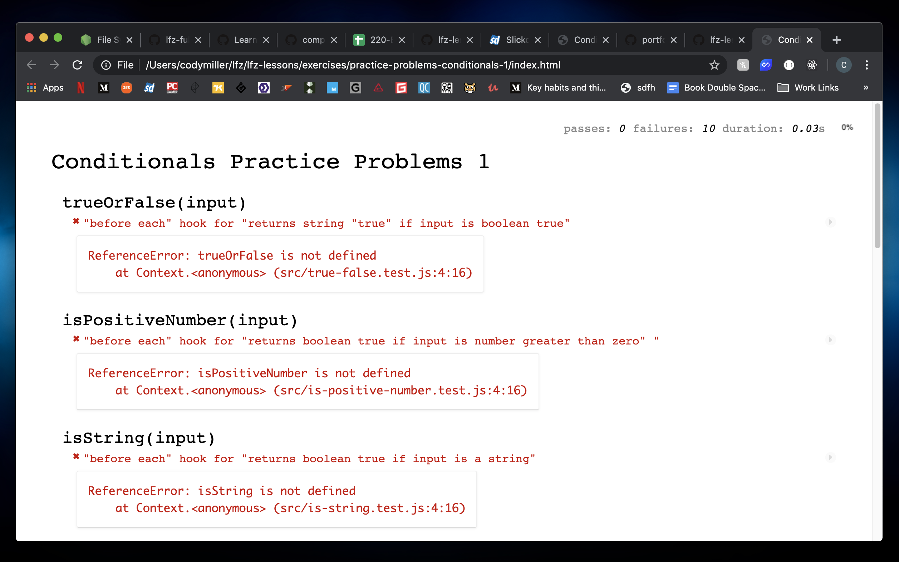
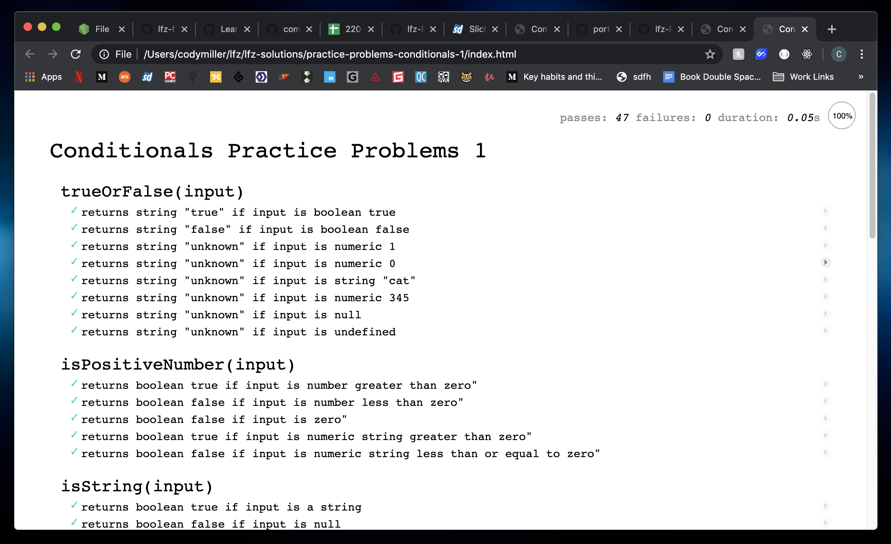

# practice-problems-conditionals

JavaScript conditionals practice with unit tests.

### Before You Begin

Be sure to check out a new branch (from `master`) for this exercise. Detailed instructions can be found [**here**](../../guides/before-each-exercise.md). Then navigate to the `exercises/practice-problems-conditionals` directory in your terminal.

### Exercise

For this exercise you will be implementing several functions involving conditionals. You are given a description of each function, a suite of unit tests for each function, and an empty JavaScript file in which to write your implementation.

Your goal is to define each function according to its description, such that all of its tests pass.

Begin by skimming through `index.html` in your code editor, then opening it in your web browser. You should see **`ReferenceError: ... is not defined`** a few times on the page.

<p align="middle">
  
</p>

Open `src/true-false.js` and `src/true-false.test.js` in your code editor and skim the code in `true-false.test.js`. As you add to or modify `true-false.js`, reload `index.html` in your browser to receive feedback. Work through defining each function specified below until all unit tests pass.

<p align="middle">
  
</p>

1. ### `trueOrFalse(input)`

    The purpose of this function is to check if an `input` is Boolean true or false.

    #### Parameters

      - `input` - A piece of data of an indeterminate type

    #### Return Value

    A string of `"true"` or `"false"` if the input is a boolean of that type, or string `"unknown"` if the input is not either boolean value.

    #### Examples

    ```js
    var argument1 = true;
    trueOrFalse(argument1); // -> "true"

    var argument2 = false;
    trueOrFalse(argument2); // -> "false"

    var argument3 = 7;
    trueOrFalse(argument3); // -> "unknown"

    var argument4 = "true";
    trueOrFalse(argument4); // -> "unknown"
    ```

1. ### `isPositiveNumber(input)`

    The purpose of this function is to determine if the `input` is a positive number.

    ***NOTE:*** This function should accept numbers as a string as well.

    #### Parameters

      - `input` - A piece of data of an indeterminate type

    #### Return Value

    - A boolean value representing whether the given `input` is a positive number or not.

    #### Examples

    ```js
    var argument1 = 3;
    isPositiveNumber(argument1); // -> true

    var argument2 = -8;
    isPositiveNumber(argument2); // -> false

    var argument3 = "65";
    isPositiveNumber(argument3); // -> true
    ```

1. ### `isString(input)`

    The purpose of this function is to determine if the `input` is a string datatype.

    #### Parameters

      - `input` - A piece of data of an indeterminate type

    #### Return Value

    - A boolean value representing whether the given `input` is a string or not.

    #### Examples

    ```js
    var argument1 = "cat";
    isString(argument1); // -> true

    var argument2 = -8;
    isString(argument2); // -> false

    var argument3 = "65";
    isString(argument3); // -> true
    ```

1. ### `isTruthy(input)`

    The purpose of this function is to determine if the `input` is a truthy value.

    #### Parameters

      - `input` - A piece of data of an indeterminate type

    #### Return Value

    - A boolean value representing whether the given `input` is truthy or not.

    #### Examples

    ```js
    var argument1 = 345;
    isTruthy(argument1); // -> true

    var argument2 = "";
    isTruthy(argument2); // -> false

    var argument3 = "stuff";
    isTruthy(argument3); // -> true
    ```

1. ### `isDefined(input)`

    The purpose of this function is to determine if the `input` of this function was given a value that is not `undefined`.

    #### Parameters

      - `input` - A piece of data of an indeterminate type

    #### Return Value

    - A boolean value representing whether the given `input` has a value that is not `undefined`.

    #### Examples

    ```js
    var argument1 = 345;
    isDefined(argument1); // -> true

    isDefined(); // -> false

    var argument3 = undefined;
    isDefined(argument3); // -> false
    ```

1. ### `canDriveLegally(age)`

    The purpose of this function is to receive a number representing a person's age, and determine if they can drive legally. In the state of California, the legal driving age is 16.

    #### Parameters

      - `age` - A number representing a person's age

    #### Return Value

    A boolean representing whether the `age` value given is old enough to drive.

    #### Examples

    ```js
    var argument1 = 34;
    canDriveLegally(argument1); // -> true

    var argument2 = 13;
    canDriveLegally(argument2); // -> false

    var argument3 = 6;
    canDriveLegally(argument3); // -> false
    ```

1. ### `canDrinkLegally(age)`

    The purpose of this function is to receive a number representing a person's age, and determine if they can drink legally. In the state of California, the legal drinking age is 21.

    #### Parameters

      - `age` - A number representing a person's age

    #### Return Value

    A boolean representing whether the `age` value given is old enough to drink.

    #### Examples

    ```js
    var argument1 = 25;
    canDrinkLegally(argument1); // -> true

    var argument2 = 19;
    canDrinkLegally(argument2); // -> false

    var argument3 = 16;
    canDrinkLegally(argument3); // -> false
    ```

1. ### `canDrinkAndDriveLegally(age)`

    The purpose of this function is to receive a number representing a person's age, and determine if they can drink and drive legally. As you might know, there is no age at which it is legal to drink and drive. A good driver is a responsible driver!

    #### Parameters

      - `age` - A number representing a person's age

    #### Return Value

    A boolean representing whether the `age` value given is old enough to drink and drive legally (always false!).

    #### Examples

    ```js
    var argument1 = 34;
    canDrinkAndDriveLegally(argument1); // -> false

    var argument2 = 79;
    canDrinkAndDriveLegally(argument2); // -> false

    var argument3 = 53;
    canDrinkAndDriveLegally(argument3); // -> false
    ```

1. ### `getLetterGrade(numericGrade)`

    The purpose of this function is to receive a number representing a person's grade in a class, and determine what their letter grade would be.

    #### Parameters

      - `numericGrade` - A number representing a student's grade

    #### Return Value

    A string representing what letter grade corresponds to a student's numeric grade.

    #### Examples

    ```js
    var argument1 = 67;
    getLetterGrade(argument1); // -> "D"

    var argument2 = 89;
    getLetterGrade(argument2); // -> "B"

    var argument3 = 73;
    getLetterGrade(argument3); // -> "C"
    ```

1. ### `getSalutation(hourOfDay)`

    The purpose of this function is to receive a number representing what hour of the day it is (0-23), and return the proper salutation for that time of day.

    #### Parameters

      - `hourOfDay` - A number representing an hour of day in the format of a [24-hour clock](https://en.wikipedia.org/wiki/24-hour_clock).

    #### Return Value

    A string representing the proper salutation at the hour of the day given as an argument to the function.

    - (0 - 11) -> "good morning!"
    - (12 - 16) -> "good afternoon!"
    - (17 - 20) -> "good evening!"
    - (21 - 24) -> "good night!"

    #### Examples

    ```js
    var argument1 = 9;
    getSalutation(argument1); // -> "good morning!"

    var argument2 = 22;
    getSalutation(argument2); // -> "good night!"

    var argument3 = 18;
    getSalutation(argument3); // -> "good evening!"
    ```

### Submitting Your Solution

When your solutions are complete, return to the root of your `lfz-mod-2-lessons` directory. Then commit your changes, push, and submit a Pull Request on GitHub.
